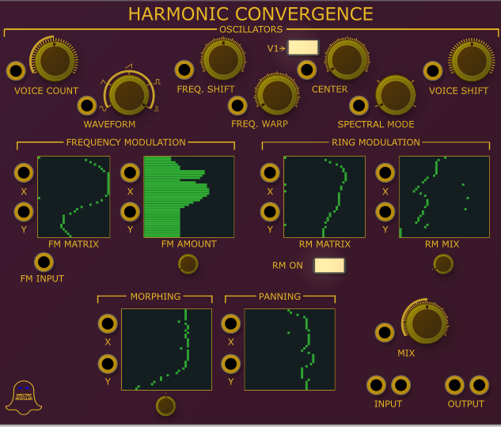
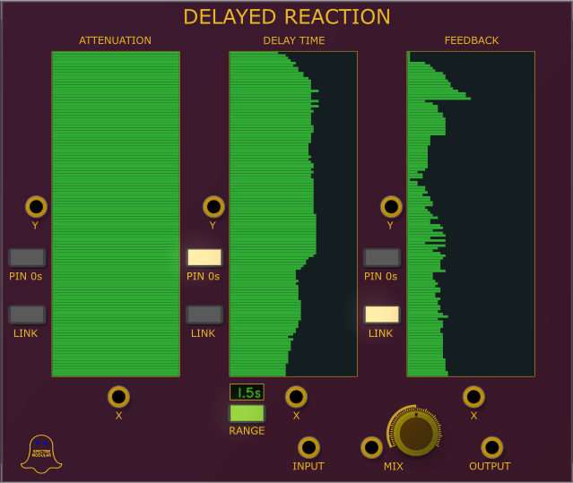
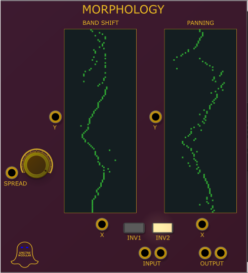

# Spectre Modular VCV plugins

Frequency Domain based VCV Plugins

## Harmonic Convergence

- Tempo Sync'd LFO.
- CV Control of Time Multiplication/Division to create LFOs sync'd to some ratio of clock
- Phase Control allows LFOs to be offset (cv controllable). 90° button limits offset to 0, 90, 180, 270 degrees.
- Pairs well with the Quad Algorithmic Rhythm
- When Holding is active, the Outputs stay at last value
- Hold input can either be a gate (which switches each time) or momentary (active while signal is positve)
- If set to Free, LFO still runs while being held (even if outputs don't change), Pause causes LFO to pause.

## Delayed Reaction

- In loving memory of Native Instrument's Spektral Delay.
- Each frequency band can have its own initial volume level, delay time and feedback amount

## Morphology

- Expander for both BPM LFO and BPM LFO 2 offering multiple phase outputs.
- Phase Division specifies the equal phase spacing of the outpus (CV Controllable)
- Integer button forces dision to be integer value, turning it off allows smooth slewing between divisions
